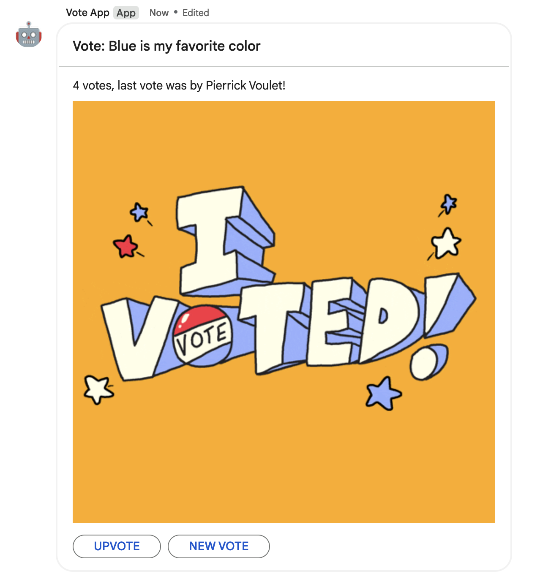

# Google Chat vote app

This code sample creates a Google Chat vote app that allows users to vote
on a message.

## Deploy the sample

  1. Follow the steps in [Build a Google Chat app with Google Apps Script](https://developers.google.com/workspace/chat/quickstart/apps-script-app)
     to set up your environment, set up the script, and publish the Chat app.

  1. Replace the script `Code.gs` with the one in this project.

## Interact with the app

Either add or @mention the app in a space or in a direct mention to start a new vote session.

You can specify the statement to start a new vote session for when mentioning the app,
for example `@VoteApp Blue is my favorite color`.
