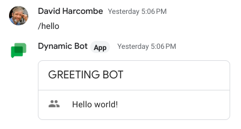
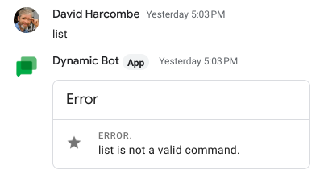

# Google Chat App Dynamic Commands

This sample shows how to load dynamic commands for a Python Cloud Function-based
Chat App from a Google Cloud Storage Bucket to allow for a faster prototyping
and development experience.

> **IMPORTANT NOTE** \
> This solution has a potential to be used for arbitrary code
> injections. As a result, care should be taken when
> considering whether or not to promote this solution to production.

## Deploying the sample

1. [Install the Google Cloud SDK](https://cloud.google.com/sdk/downloads)
   if you haven't already and ensure the `gcloud` command works.
1. [Create a new Google Cloud Platform project](https://console.cloud.google.com)
   or select an existing project.
1. [Install the Chat App](#installsh) using the provided installer (`install.sh`).
   - If you'd rather perform these steps manually,
     [information](#manual-installation-and-gcp-setup) is at the bottom
     of this README
1. [Copy the contents of the `command_files`](#copy-the-dynamic-commands-to-cloud-storage) to the bucket in
   Google Cloud Storage.
2. [Setup your Chat App](#set-up-the-chat-app-in-cloud-console) (you will need information from step 3 to complete
   this.).

## `install.sh`

This is a simple shell command file to assist with the installation process.

At a minimum, it should be run specifing the project into which the App is to
be installed, along with the service account as which it will run.

```
./install.sh --project <PROJECT> --service-account <SERVICE ACCOUNT>
```

If this is the first time, there are 2 other switches that can be added:

- `--activate-apis` \
  This will ensure that all neccessary APIs have been activated in the selected
  project, and attempt to activate any missing ones for you.
- `--deploy-storage` \
  This will attempt to create the bucket needed to store the dynamic command
  files. The bucket has a standard name of `<PROJECT>-dynamic-commands`
  ensuring it's uniqueness, and is hardwired in the code for security reasons.

Running `install.sh` with no switches (or with `--help` / `-?`) will print a
complete list of usage instructions.

The installer will also deploy the Cloud Function and all it's necessary files
from the current directory, printing out the result of the deployment like so:


```
availableMemoryMb: 4096
buildId: ...
buildName: ...
dockerRegistry: CONTAINER_REGISTRY
entryPoint: dynamic
environmentVariables:
  GOOGLE_CLOUD_PROJECT: <PROJECT>
httpsTrigger:
  securityLevel: SECURE_OPTIONAL
  url: <CHAT APP ENDPOINT URL>
ingressSettings: ALLOW_ALL
labels:
  deployment-tool: cli-gcloud
name: <FUNCTION NAME>
runtime: python310
serviceAccountEmail: <SERVICE ACCOUNT>
sourceUploadUrl: <SOURCE URL>
status: ACTIVE
timeout: 240s
updateTime: '2023-05-03T21:56:37.501Z'
versionId: '1'
```

Take a note of the `<CHAT APP ENDPOINT URL>`. This is what you will need to
complete the final step of the deployment in the Cloud Console UI.

## Copy the dynamic command(s) to Cloud Storage

After the install has completed (if you used `--deploy-storage`), there will
be a bucket with the following cloud storage URL:

```
gs://<PROJECT>-dynamic-commands
```

You should now copy the contents of the `command_files` folder into this bucket.
These are the dynamic commands that the Chat App will recognize and load.
This can be done from the command line with the following command:

```
gsutil -m cp command_files/* gs://<PROJECT>-dynamic-commands
```

## Set up the Chat App in Cloud Console

1. On the [Google Chat Configuration
  tab](https://console.cloud.google.com/apis/library/chat.googleapis.com),
  customize your app by setting the following values:
  - **App status**: LIVE - Available to users
  - **App name**: "Dynamic App"
  - **Avatar URL**: `https://developers.google.com/chat/images/chat-product-icon.png`
  - **Description**: "Dynamically loaded chat functionality."
  - **Functionality**: Enable 'Receive 1:1 messages', leave 'Join spaces' unchecked.
  - **Connection settings**: Select 'App URL' and enter the `<CHAT APP ENDPOINT URL>` from above.
  - **LOGS**: Enable 'Log errors to Logging'
1. Click **Save changes** to publish your app

## Test the Chat App

To check the app, simply start a 1:1 Chat with 'Dynamic App'!

If you type `hello` or `/hello`, you will see this:



Any other text (such as `list`, as seen here) will result in an error:



You can now prove how dynamic the code is by changing the message in the file
`command_files/hello.py` and re-executing the copy command above. If you rename
the command to something else (like `list.py`, for example) and delete
`hello.py` from the folder on Cloud Storage, you will change the command to
which the app responds.

## Creating your own dynamic classes

All you need to to is create a new class extending `classes.dynamic.DynamicClass`,
as you can see in `hello.py`. The new class **MUST** implement a method

```python
def run(self, **attributes: Mapping[str, str]) -> Dict[str, Any]:`
```

which is called when loaded. You can see this in the main class of this sample,
`dynamic_command.py`, in the method `execute_dynamic_command`. The return
value is the Chat response in JSON.

> **IMPORTANT NOTE** \
> Dynamic functions can only access libraries already mentioned in the
> `requirements.txt` file. If you are planning on using any other Cloud APIs
> (Big Query, or Secret Manager for example) or other third party libraries,
> you will have to ensure that those APIs are included in the `requirements.txt`
> file and the entire Cloud Function will need to be redeployed to include them
> prior to trying to use them in a dynamic class.

---

## Manual installation and GCP setup

### Activate APIs

Several Cloud APIs need to be active for this sample to run. They are:
- `chat`
- `cloudbuild`
- `cloudfunctions`
- `logging`
- `pubsub`
- `storage`
- `storage-api`

You can check if they are active by execulting the following `gcloud` CLI
command:

```
gcloud --project=<PROJECT> services list
```

**NOTE**: they all end with `googleapis.com`, so `chat.googlapis.com` etc.

If any are missing, you can activate them using the UI (in
[Cloud Console](https://console.cloud.google.com/apis/library)) or from the
`gcloud` CLI like so:

```
gcloud --project=<PROJECT> services enable <API NAME>.googleapis.com
```

### Setup Google Cloud Storage

The system expects to find a bucket named `<PROJECT>-dynamic-commands`. This
should be secured so that only the service account as which the cloud function
runs has access to stop just anyone adding commands to your chat app!

The bucket can be created in the
[Cloud Console UI](https://console.cloud.google.com/storage/browser), or from
the `gsutil` CLI as follows:

```
gsutil mb -p <PROJECT> gs://<PROJECT>-dynamic-commands
```


### Deploy the Cloud Function

The Cloud Function can be deployed easily from the `gcloud` CLI using the
following command:

```bash
gcloud functions deploy "dynamic_commands"      \
  --entry-point=dynamic                         \
  --service-account=<SERVICE ACCOUNT>           \
  --runtime=python310                           \
  --source=`pwd`                                \
  --set-env-vars=GOOGLE_CLOUD_PROJECT=<PROJECT> \
  --memory=4096MB                               \
  --timeout=240s                                \
  --trigger-http                                \
  --allow-unauthenticated                       \
  --quiet                                       \
  --project=<PROJECT>
```

or from the [Cloud Console UI](https://console.cloud.google.com/functions).
